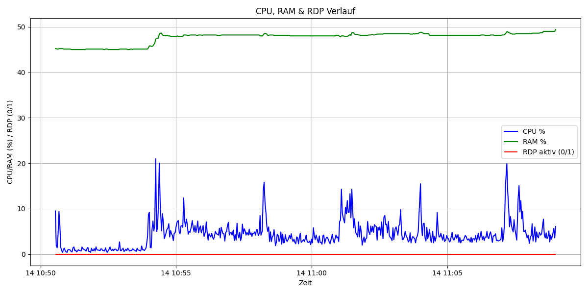

# CPU & RAM Logger with RDP Status

A Windows service and standalone Python tool for continuously monitoring CPU usage, RAM usage, and Remote Desktop (RDP) activity. Logs are saved to Excel files, with automatic summary statistics and visual charts when processed manually.



## Features

* Monitors CPU and RAM usage at configurable intervals.
* Detects active RDP sessions and logs their state.
* Saves data to Excel (`.xlsx`) files with timestamped filenames.
* **Note:** In this service version, data is only logged. Visualization and summary charts must be generated manually using `cpu_logging_interpretation.py`.
* Runs as a Windows service for background monitoring.
* Optional command-line interface for analyzing and visualizing existing logs.
* Graceful stop support when running as a service.

---

## Installation

### Install dependencies:

```bash
pip install -r requirements.txt
```

### Installation as Windows Service

1. Open a command prompt as Administrator.
2. Navigate to the project folder.
3. Install the service:

```cmd
python cpu_logging_service.py install
```

4. Start the service:

```cmd
python cpu_logging_service.py start
```

5. Stop the service:

```cmd
python cpu_logging_service.py stop
```

6. Remove the service:

```cmd
python cpu_logging_service.py remove
```

> **Note:** By default, logs are saved to:
>
> ```text
> C:\CPU-Logging-Service\Logs
> ```
>
> and the sampling interval is 2 seconds.
> You can modify these defaults in `cpu_logging_service.py` for development or testing.

## Analyzing Existing Logs

After collecting data with the service, use the `cpu_logging_interpretation.py` script to create charts and summaries from existing log files:

```bash
python cpu_logging_interpretation.py --input "C:\Logs\cpu_ram_rdp_log_2025-10-14_14-30-00.xlsx" --cpu 80 --ram 70
```

* `--input` → path to the log file
* `--cpu` → CPU usage threshold for statistics (default 10%)
* `--ram` → RAM usage threshold for statistics (default 10%)

Charts are saved in the same directory as the log file and embedded into the Excel summary sheet.

## Author

Till Stinner

## License

This project is released under the MIT License.
