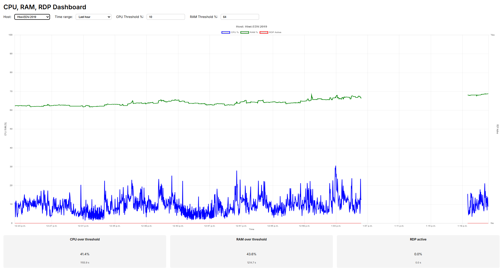

# CPU Logging Repository

This repository contains three main modules for monitoring CPU, RAM, and RDP usage on Windows systems:

1. **CPU-Logging-Service** – runs as a Windows service for background monitoring.
2. **CPU-Logging** – standalone terminal-based version for manual execution and interactive logging.
3. **CPU Logging Dashboard** – web-based real-time monitoring of multiple clients.


---

# Module 1: CPU-Logging-Service

A Windows service for continuously monitoring CPU and RAM usage, as well as active RDP sessions, logging the data to Excel files.

## Features

* Continuous background monitoring as a Windows service.
* Logs CPU, RAM, and RDP activity to timestamped Excel files.
* Manual analysis and visualization via `cpu_logging_interpretation.py`.
* Graceful stop supported.

## Installation

### Dependencies:

```bash
pip install -r requirements.txt  # specific to CPU-Logging-Service
```

### Windows Service Installation

```cmd
python cpu_logging_service.py install
python cpu_logging_service.py start
python cpu_logging_service.py stop
python cpu_logging_service.py remove
```

> Logs are saved by default to `C:\CPU-Logging-Service\Logs`, interval: 2 seconds.

## Manual Analysis

```bash
python cpu_logging_interpretation.py --input "C:\Logs\cpu_ram_rdp_log_YYYY-MM-DD_HH-MM-SS.xlsx" --cpu 80 --ram 70
```

---

# Module 2: CPU-Logging (Predecessor)

Terminal-based logging and analysis tool. Data is collected in Excel and simultaneously printed to the console.

## Features

* Interactive terminal mode.
* Logs CPU, RAM, and RDP activity to Excel with timestamped filenames.
* Displays real-time values in the console.
* Automatically generates summary statistics and charts after logging.

## Usage

Run the main script:

```bash
python cpu_logging_v04.py
```

* Enter the duration in seconds (0 for infinite) when prompted.
* Logs are saved as `cpu_ram_rdp_log_<timestamp>.xlsx`.
* After logging, analyze and visualize using:

```bash
python cpu_logging_auswertung_v02.py --input "cpu_ram_rdp_log_<timestamp>.xlsx" --cpu 80 --ram 70
```

* Charts are saved as `cpu_ram_rdp_chart_<timestamp>.png` and embedded in the Excel summary.

## Dependencies

```bash
pip install -r requirements_logging.txt  # specific to CPU-Logging module
```

---

# Module 3: CPU Logging Dashboard

Web-based real-time monitoring of multiple clients, visualizing metrics collected by the service.



## Features

* Displays CPU %, RAM %, and RDP activity for multiple hosts.
* Live updates every 5 seconds.
* Input thresholds for CPU and RAM to calculate % of time above thresholds.
* Summary bars display percentage and actual time (seconds) above thresholds.
* Handles gaps in logging and breaks RDP lines when state changes.

## Installation

### Dependencies:

```bash
pip install -r requirements.txt
```

### Running

Start the Django server (default port 8000):

```bash
python manage.py runserver
```

Access the dashboard at:

```
http://<server-ip>:8000/dashboard/
```

### Client Setup

The client service must run the `CPU-Logging-Dashboard\Logging-Service\cpu_logging_service_dashboard.py` script in the same way as the Windows service module.

* Ensure the `API_URL` in the script points to the Django server IP.
* Logs CPU, RAM, and RDP activity and sends metrics to the dashboard in real time.

### Usage

* Select the host and time range.
* Adjust CPU/RAM threshold to see time-over-threshold calculations update live.
* Visual summary shows bars and seconds spent above thresholds.

---

# Author

Till Stinner

# License

MIT License

---

**Note:**

* CPU-Logging-Service is intended for continuous background monitoring.
* CPU-Logging is intended for interactive, terminal-based logging and is the predecessor of the service version.
* CPU Logging Dashboard provides a real-time web interface for monitoring multiple clients.
